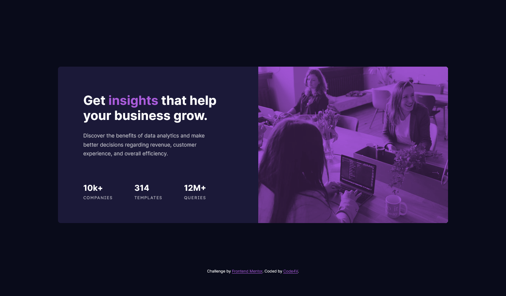
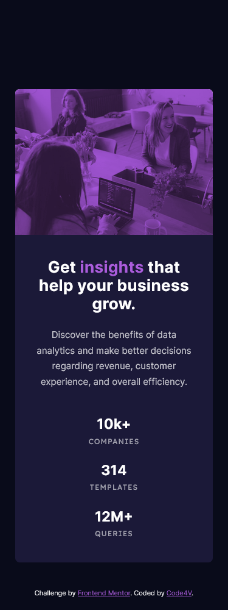

# Frontend Mentor - Stats preview card component solution

This is a solution to the [Stats preview card component challenge on Frontend Mentor](https://www.frontendmentor.io/challenges/stats-preview-card-component-8JqbgoU62). Frontend Mentor challenges help you improve your coding skills by building realistic projects. 

## Table of contents

- [Overview](#overview)
  - [The challenge](#the-challenge)
  - [Screenshot](#screenshot)
  - [Links](#links)
- [My process](#my-process)
  - [Built with](#built-with)
- [Author](#author)

## Overview

### The challenge

Users should be able to:

- View the optimal layout depending on their device's screen size

### Screenshot

### Links

- Solution URL: [Solution Link](https://github.com/Code4V/stats-preview--frontend-mentor)
- Live Site URL: [Live Site](https://code4v.github.io/stats-preview--frontend-mentor/)

## My process

1. Installed webpack, sass, and Pug
2. Built the basic HTML structure using the Pug, which feels alot like doing sass
3. Added styling
4. Tweaks and Adjustments 

### Built with

- Semantic HTML5 markup
- Flexbox
- [SASS](https://sass-lang.com/) - CSS Preprocessor
- [Pug](https://pugjs.org/) - HTML Preprocessor

## Author

- Github - [Code4V](https://www.github.com/Code4V)
- Frontend Mentor - [@code4v](https://www.frontendmentor.io/profile/code4v)

